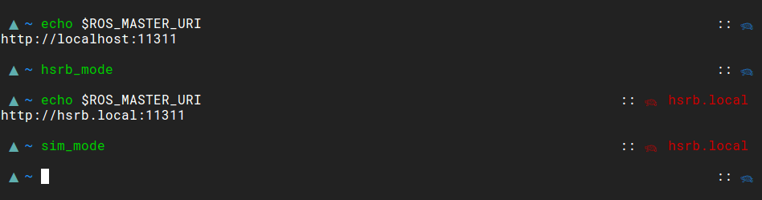

# ROS Master - Geometry

<a href="http://www.wtfpl.net/"></a>

ROS Master is a plugin for the geometry zsh theme that briefly tells you what
your ROS Master URI is. You might find this useful if you have multiple
machines, like a local simulation machine and the remote actual machine.



ROS Master tells gives you a turtle, the mascot of ROS. If the turtle is blue,
your ROS Master URI points to your machine. If the turtle is red, your master
is on another machine. When the turtle is red, you'll also see what the address
is of the machine, which is useful if you have multiple machines, or for
debugging.

## Install

I use antigen, but the general format is this:

``` shell
$ source /path/to/geometry.zsh
$ git clone git@github.com:the-mikedavis/geometry-ros-master
$ cd geometry-ros-master && source plugin.zsh
```

**N.B.**: the plugin comes after the theme.

### Antigen

```shell
antigen theme geometry-zsh/geometry     #geometry first, then...
antigen bundle the-mikedavis/geometry-ros-master
```

## License

This plugin is licensed under the 'Do What the Fuck You Want to Public Licence.'
See `LICENSE.txt` for more information.
